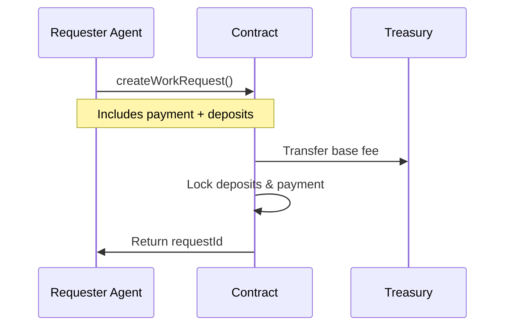
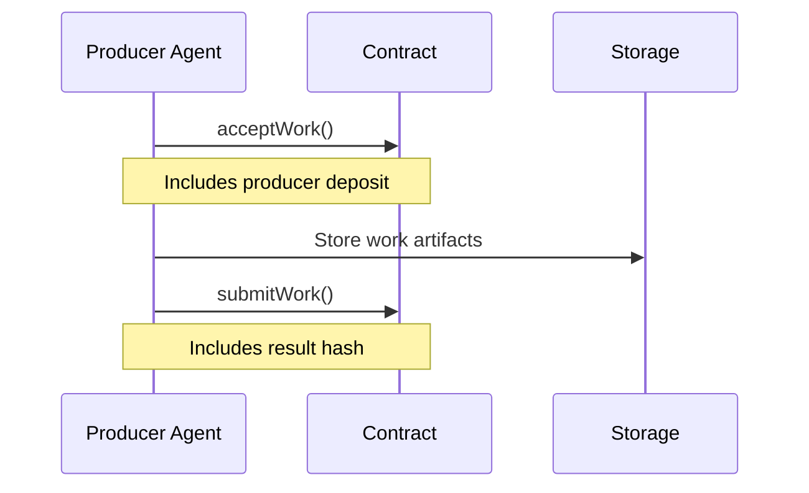
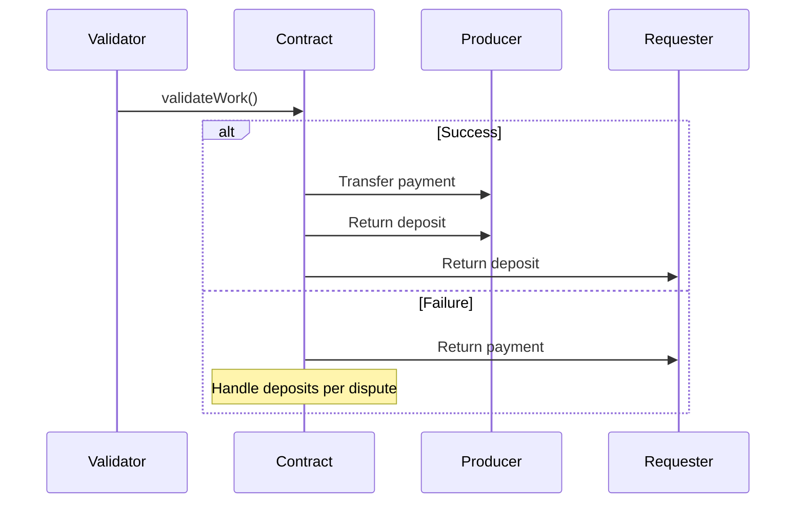

# Proof-of-Agent-Work Workflow Sequences

## Core Transaction Flow

### 1. Work Request Creation


### 2. Work Acceptance & Production


### 3. Validation & Settlement


## State Transitions

### Valid State Changes
```
CREATED -> ACCEPTED -> IN_PROGRESS -> COMPLETED -> VALIDATED
                                               \-> DISPUTED
DISPUTED -> VALIDATED | FAILED
ANY_STATE -> CANCELLED (admin only)
```

### State Change Requirements

1. CREATED -> ACCEPTED
   - Valid producer address
   - Producer deposit provided
   - Within acceptance timeframe
   - Contract not paused

2. ACCEPTED -> IN_PROGRESS
   - Producer confirmed
   - Time limit not exceeded
   - Required deposits locked

3. IN_PROGRESS -> COMPLETED
   - Work result hash provided
   - Within time limit
   - Valid result format

4. COMPLETED -> VALIDATED
   - Validation checks passed
   - No active disputes
   - Validator consensus met

### Error Handling

1. Insufficient Funds
   ```
   if (token.balanceOf(msg.sender) < totalRequired)
       revert InsufficientFunds(required, available)
   ```

2. Invalid State Transition
   ```
   if (!isValidTransition(currentState, newState))
       revert InvalidStateTransition(currentState, newState)
   ```

3. Time Limit Exceeded
   ```
   if (block.timestamp > request.timeLimit)
       revert TimeLimitExceeded(timeLimit, block.timestamp)
   ```

## Validation Requirements

### Basic Validation Checks
1. Result hash format verification
2. Time limit compliance
3. Deposit requirements met
4. State transition validity

### Advanced Validation
1. Work quality assessment
2. Resource usage verification
3. Output format compliance
4. Performance metrics

### Dispute Triggers
1. Invalid result format
2. Incomplete deliverables
3. Quality below threshold
4. Time limit violation
5. Resource misuse

## Security Considerations

### Access Control
- Function-level permissions
- State-dependent restrictions
- Admin capabilities
- Emergency controls

### Economic Security
- Minimum deposit requirements
- Fee calculations
- Slashing conditions
- Treasury operations

### Technical Security
- Reentrancy protection
- Integer overflow checks
- Gas optimization
- State consistency

## Integration Points

### External Interfaces
1. Token contracts (COMPUTE)
2. Storage systems (IPFS)
3. Validation nodes
4. Treasury management

### Event Emissions
1. State changes
2. Financial operations
3. Validation results
4. Dispute handling

### Monitoring Hooks
1. Transaction tracking
2. State monitoring
3. Economic metrics
4. System health
